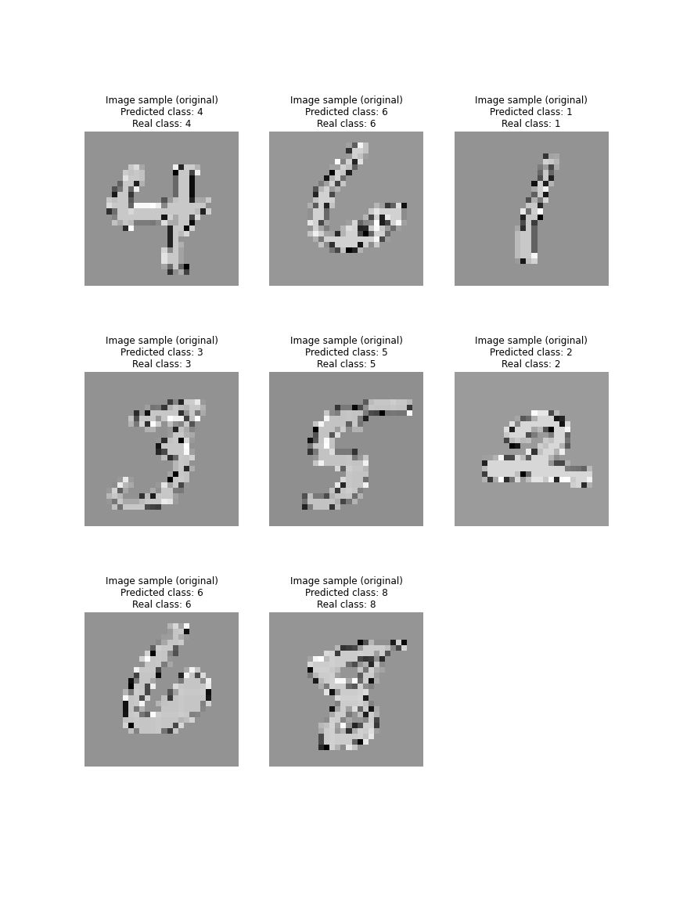

# PerceiverIO Classifier

Implementation of a Perceiver IO classifier in Pytorch by Eric Buehler

## PerceiverIO
The PerceiverIO used in this model is lucidrains's implemenation, found at https://github.com/lucidrains/perceiver-pytorch.

## Training
The model was trained for 50 epochs. I used MSE (Mean Squared Error) loss for the criterion, an Adam optimizer (lr = 0.0001), and an ExponentialLR schedular with a gamma of 0.9.

By epoch 1 of training on the MNIST dataset, it achieves 97% accuracy and a test loss of 0.005.

Below is an example of a test after epoch 1:

Accuracy, and test/train loss plots are provided below:

