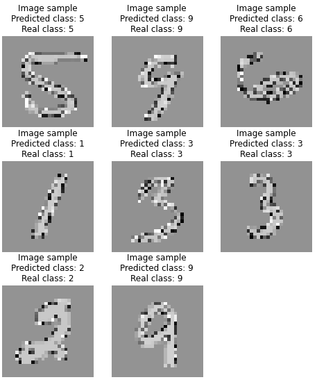
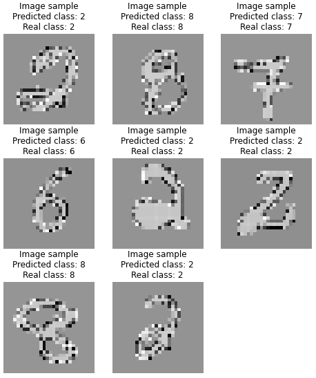
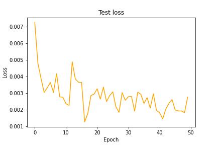

# PerceiverIO Classifier

Implementation of a Perceiver IO classifier in PyTorch by Eric Buehler

## PerceiverIO
The PerceiverIO used in this model is lucidrains's implemenation, found at https://github.com/lucidrains/perceiver-pytorch.

[Explanation of PerceiverIO paper and architecture](https://www.youtube.com/watch?v=P_xeshTnPZg)
## Training
The model was trained for 50 epochs. I used MSE (Mean Squared Error) loss for the criterion, an Adam optimizer (lr = 0.0001), and an ExponentialLR schedular with a gamma of 0.9.
The image size used is 28x28, with a color depth of 1 (black and white). The batch size for training is 64 and the corresponding test batch size is 1000.

By epoch 1 of training on the MNIST dataset, the model achieves 95% accuracy and a test loss of 0.007.

Below is an example of a test after epoch 1:



After training for 50 epochs, the model achieves 98% accuracy, and a test loss of 0.002.

Below is an example of a test after epoch 50:



Accuracy, and test/train loss plots are provided below:





## Usage
This model is designed to be trained on Google Colab. The use of a GPU is highly reccommended, and I used a P100.

The below code will create a "Colab Notebooks/PercieverIO_Classifier" directory in your Google Drive. 
```
modelname="2_4_22_m1"


drive.mount('/content/drive')

prefix='/content/drive/MyDrive/Colab Notebooks/PercieverIO_Classifier/'

try:
    os.mkdir(prefix)
except FileExistsError:
    pass

prefix_images=prefix+'images/'
try:
    os.mkdir(prefix_images)
except FileExistsError:
    pass
try:
    os.mkdir(prefix_images+modelname+"/")
except FileExistsError:
    pass

prefix_models=prefix+'models/'+modelname+"/"
try:
    os.mkdir(prefix+'models/')
except FileExistsError:
    pass
try:
    os.mkdir(prefix_models)
except FileExistsError:
    pass

CPUonly=False
```

Line 2 in the above code mounts your Google Drive, and line 3 defines the prefix. Aside from the ```modelname``` definition and the ```CPUonly``` definition, the rest of the above code creates the required folders to hold the training progress.
The variable ```modelname``` is used to provide some automation of version control.

To run the training  code, open it in Google Colab. Set the modelname (or potentially prefix) to your own value and run the code. It will train the model for 50 epochs. Under the ```Important variables``` section in the code, you can find the definition of many simpler hyperparameters like the image size and the batch sizes. Under the ```Autoload/define model and setup criterion, optimizer, and scheduler```, and in the ```Define criterion, optimizer, and scheduler``` subsection, the loss, learning rate, optimizer, and scheduler are all defined.

## Figures 
I have also attached a program to generate figures. Similarly to the training program, this program also requires that ```modelname``` and ```prefix``` be set to their appropriate values. This code will generate and save the figures for model ```modelname```, in the **prefix**/models/**modelname** directory.

## Enviornment
All codes are designed to be run on Google Colab. It is highly recommended to run the train code with GPU, but not required. The figure generation code does not require a GPU.


